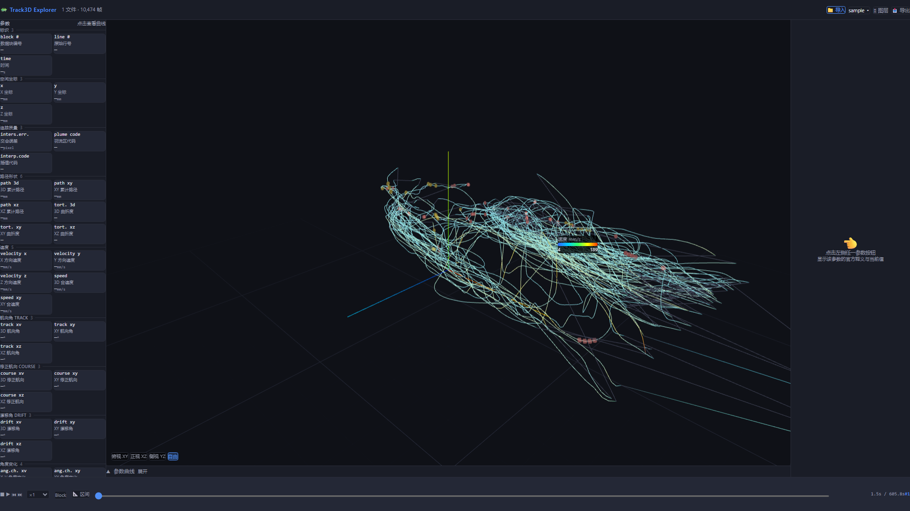
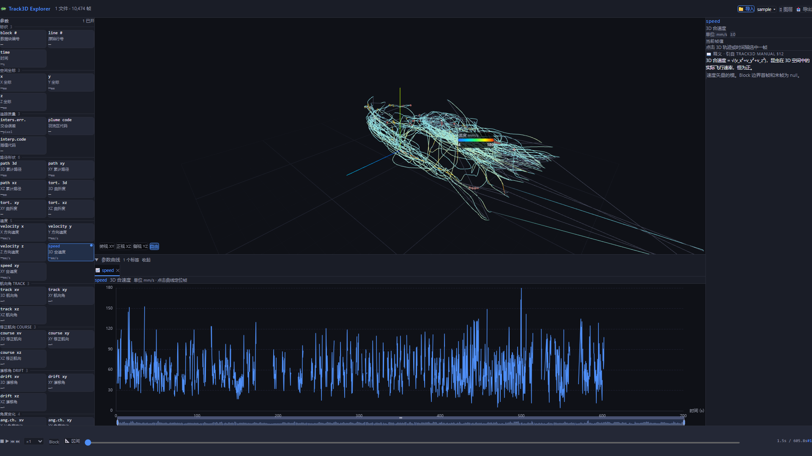
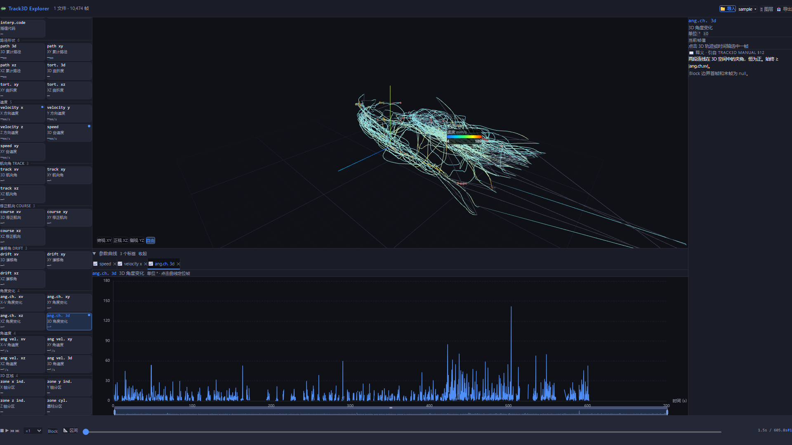

# 3D轨迹数据分析可视化Web平台

## 需求设计文档

---

| 版本 | 日期 | 作者 | 变更说明 |
|------|------|------|----------|
| v1.0 | 2026-08-03 | — | 初稿 |
| v1.1 | 2026-08-03 | — | 基于实际样本数据 (out_3d.xls) 与 Reference Manual 更新字段映射 |
| v2.0 | 2026-08-03 | — | 深度研读 Reference Manual，重新设计核心交互：点数据联动多维可视化 |

---

## 📋 功能描述

> **一句话**：把荷兰 Noldus Track3D 桌面软件导出的 41 列 3D 轨迹数据，变成一个**浏览器里可交互、可点击、每个参数都能"点开看曲线"的 Web 可视化平台**，解决科研人员看数据时的割裂与低效。

### 解决了什么问题

科研人员用 Track3D 桌面版分析昆虫（如蚊子）飞行轨迹时，长期面临这些痛点：

| 痛点 | 桌面版现状 | 本平台 |
|------|-----------|--------|
| 数据查看割裂 | 3D 轨迹在 MATLAB 窗口、数据在 Excel，来回切换 | 一个界面看全部 |
| 点击信息太少 | Data Cursor 仅显示 X/Y/Z + 时间 | 点击 → 41 参数全维度上下文 + 官方释义 |
| 无时序图表 | 看不到"速度随时间怎么变" | 每个参数一键看「值 vs 时间」曲线 |
| 无联动 | 3D 选点无法同步定位到曲线时刻 | 3D / 曲线 / 释义 / 时间轴全联动 |
| 学习陡峭 | 41 字段含义要翻 139 页 PDF 手册 | 每个参数内嵌官方释义（引自 Manual §12） |
| 单文件分析 | 不同个体无法叠加对比 | 多文件加载、多参数标签同时对比 |

### 核心能力

1. **一键导入**：拖入 `out_3d.xls` / `out_3d-2.xls`，浏览器端 SheetJS 自动解析 41 列、无需后端
2. **方框参数网格**：41 个参数以方框卡片网格呈现（按 10 类分组），卡片实时显示当前帧数值
3. **点击即洞察**：点任一参数卡片 → 中栏下方独立面板出现该参数随时间变化曲线；点击曲线上某点 → 3D 当前点高亮、右栏释义刷新、时间轴同步
4. **3D 独立界面**：3D 轨迹视图独占上方主区域（Three.js，按速度渐变着色、可旋转/缩放/预设视角），不与参数曲线混排
5. **官方释义**：右栏释义面板逐字引自 Track3D 2.0 Reference Manual Chapter 12，附当前帧实时值
6. **纯前端、暗色、静态部署**：零后端、零运维，丢到任意静态服务器即可公网访问

### 技术栈
React 18 + TypeScript + Vite + Tailwind + Three.js (react-three-fiber) + ECharts + SheetJS + Zustand。

---

## 💬 核心 Prompt

> 以下是引导 AI（Claude Code）实现本项目的关键提示词，按阶段排列。完整对话见仓库代码与提交历史。

**1. 项目立项与规划（让 AI 先读懂领域再动手）**
```
我们要基于荷兰 Noldus Track 3D 昆虫三维轨迹跟踪系统导出的数据，开发一套 3D轨迹
数据分析可视化 Web 平台。项目文件夹下有 Track3D 2.0 Reference Manual 2021.10更新.pdf 为
说明书，out_3d.xls 为最终需要在可视化平台上显示的参数列表。先做一个规划，等我同意后再执行。
```

**2. 强制以真实数据为准（避免 AI 臆造字段）**
```
我需要针对 out_3d.xls 和 out_3d-2.xls 表头数据列表，每一个参数开发其功能……需要实现的
是：在每个参数上增加功能交互按钮，点进去后显示对应的参数随时间变化的图。具体参数解释
参考项目文件夹里的 Track3D 2.0 Reference Manual 2021.10.pdf。
```
→ AI 用 PyPDF2 提取 PDF Chapter 12 全文（81-114 页）+ 用 SheetJS 提取两文件真实表头，建立"Excel 列名 → 数据库字段 → 释义"映射，杜绝臆造。

**3. 前端骨架优先，参数即按钮**
```
先不要弄后端具体的功能实现，先把前端页面搭建起来，比如界面上的按钮、排版。我需要每个
参数加交互按钮，点进去显示该参数随时间变化的图。
```
确认项：① 参数按钮名称与 xls 表头一致 ② 中栏可打开多个参数标签对比 ③ 本阶段搭好 3D ④ 暗色主题。

**4. 3D 视图独立、不要叠加**
```
3D 轨迹显示采用独立界面显示，不要叠加在其他参数的叠加栏里面。
```
→ AI 把 3D 从"和参数曲线同一标签栏"拆出，改为上方独立常驻主区域 + 下方独立参数曲线面板。

**5. 参数按钮方框化重设计**
```
把参数按钮做成方框型的，不是这种折叠平铺。
```
→ AI 把左栏从「折叠列表」重写为 2 列方框卡片网格：每卡显示 列名/中文/当前值+单位，选中高亮、已开曲线有圆点标识。

**6. 自检与验证（AI 主动跑真机）**
AI 自主用 Playwright + 真实 xls 驱动浏览器：上传 → 点参数 → 截图 → 检查 console error，确认 0 运行时报错才交付。

---

## 🎬 演示素材

> 截图均为真实 `out_3d.xls`（10,474 帧）数据，Playwright 驱动 Chromium 实拍，0 运行时报错。

### ① 方框参数网格 + 3D 轨迹（数据加载后）


左侧 41 个参数以方框卡片网格按 10 类分组；中上方 3D 轨迹按速度渐变着色（蓝→红），可旋转/缩放/切预设视角。

### ② 点击参数 → 选中高亮 + 曲线 + 释义联动


点击 `speed` 卡片 → 选中高亮（蓝框+内发光）、右下角圆点表示曲线已打开；中下方独立面板出现 `speed` 随时间变化曲线；右栏释义面板显示官方释义（引自 Manual §12 p.94）+ 当前帧实时值。

### ③ 多参数标签同时对比


同时打开 `speed`、`velocity x`、`ang.ch. 3d` 三个参数曲线标签，可横向对比不同参数随时间的变化；3D 视图始终在上方独立显示，不受影响。

### 本地运行
```bash
cd track3d-explorer && npm install && npm run dev   # 打开 http://localhost:5173
```

---

## 目录

1. [项目背景与目标](#1-项目背景与目标)
2. [Track3D 系统概述与对标分析](#2-track3d-系统概述与对标分析)
3. [数据来源与格式](#3-数据来源与格式)
4. [核心设计理念：点击即洞察](#4-核心设计理念点击即洞察)
5. [整体技术选型方案](#5-整体技术选型方案)
6. [页面功能模块拆解](#6-页面功能模块拆解)
7. [数据字段 → 可视化映射表](#7-数据字段--可视化映射表)
8. [解释说明系统设计](#8-解释说明系统设计)
9. [3D 轨迹渲染实现思路](#9-3d-轨迹渲染实现思路)
10. [数据处理功能设计](#10-数据处理功能设计)
11. [界面原型说明](#11-界面原型说明)
12. [开发路线图](#12-开发路线图)
13. [待补充信息](#13-待补充信息)

---

## 1. 项目背景与目标

### 1.1 背景

基于荷兰 **Noldus Track 3D** 昆虫三维轨迹跟踪系统导出的实验数据，开发一套 B/S 架构的 3D轨迹数据分析可视化Web平台。

**Track3D 是什么？** Track3D 是 EthoVision XT 的附加模块，通过两台同步红外相机采集的视频，使用 DLT（Direct Linear Transformation）算法将两路 2D 坐标重建为 3D 空间坐标，并计算 41 项运动学参数（速度、角度、角速度、路径形状等）。

### 1.2 硬件环境

| 组件 | 说明 |
|------|------|
| 风洞 | 160×60×60 cm 聚碳酸酯追踪舱，气流可控（~40 cm/s） |
| 红外补光 | 4 组红外 LED 阵列，消除可见光干扰 |
| 双相机 | 至少 2 台同步红外相机，光轴夹角 ≥40°（90°最优） |
| 3D 校准架 | 40/60 cm 黑色框架 + 白色圆形标记点，用于 DLT 参数解算 |
| Noldus 软件套件 | Media Recorder（同步录制）→ EthoVision XT（2D 追踪）→ CentroidFinder（校准）→ Track3D（3D 分析） |

### 1.3 本平台定位

**对标并超越 Track3D 桌面软件的可视化与交互能力**，在 Web 端实现：

1. **数据接入** — 一键导入 Track3D 导出的 Excel 数据，自动解析 41 列字段
2. **点击即洞察** — 点击任意数据点，联动展示该点所有参数的 2D/3D 可视化与文字解释（这是 Track3D 桌面版做不到的）
3. **3D 轨迹交互** — 旋转/缩放/平移/播放，比 MATLAB Figure 窗口更流畅
4. **全参数 2D 图表** — 时序折线、分布直方图、统计箱线图，覆盖全部 41 个字段
5. **分组对比** — 不同个体/实验组的统计比较
6. **数据清洗与导出** — 异常点剔除、滤波平滑、结果导出

---

## 2. Track3D 系统概述与对标分析

> 基于 `Track3D 2.0 Reference Manual 2021.10更新.pdf`（139 页）深入研读。

### 2.1 Track3D 工作流

```
┌──────────────┐    ┌──────────────┐    ┌──────────────┐    ┌──────────────┐
│ Media        │    │ EthoVision   │    │ Centroid     │    │ Track3D      │
│ Recorder     │───▶│ XT           │───▶│ Finder       │───▶│              │
│ (同步录制)    │    │ (2D 追踪)    │    │ (DLT 校准)   │    │ (3D 分析)    │
└──────────────┘    └──────────────┘    └──────────────┘    └──────┬───────┘
                                                                   │
                                                    ┌──────────────┘
                                                    ▼
                                        ┌─────────────────────┐
                                        │ 输出：               │
                                        │ • out_3d.xls (数据)  │
                                        │ • 3D Chart (MATLAB)  │
                                        │ • AVI 视频 (可选)    │
                                        └─────────────────────┘
```

### 2.2 Track3D 桌面版功能盘点

| 功能 | Track3D 桌面版 | 本 Web 平台 |
|------|---------------|------------|
| **3D 轨迹渲染** | MATLAB Figure 窗口 | Three.js WebGL，更流畅 |
| **旋转/缩放/平移** | ✅ 工具栏按钮 | ✅ 鼠标拖拽/滚轮，更直觉 |
| **默认视图** | X-Y（俯视）、X-Z、Y-Z | ✅ 预设视图 + 自定义 |
| **Data Cursor（点击查数据）** | ✅ 显示 X,Y,Z + 时间 | ✅ **联动多维可视化 + 解释说明** |
| **多 datatip** | ✅ Alt+Click | ✅ 多选对比面板 |
| **轨迹播放** | ✅ 红点移动动画 | ✅ 粒子动画 + 速度颜色渐变 |
| **气味羽流锥** | ✅ 蓝色圆圈标记 | ✅ 可选叠加 |
| **3D 分区着色** | ✅ 锥内/缓冲/锥外三色 | ✅ 自定义分区着色 |
| **速度颜色映射** | ❌ 需 RapidMiner | ✅ 内置 |
| **速度分量图表** | ❌ 无 | ✅ velocity_x/y/z 时序图 |
| **角度变化图表** | ❌ 无 | ✅ angular_change 时序图 |
| **角速度图表** | ❌ 无 | ✅ angular_velocity 时序图 |
| **路径曲折度图表** | ❌ 无 | ✅ tortuosity 散点图 |
| **交会误差图表** | ❌ 无 | ✅ intersection_error 直方图 |
| **视频导出** | ✅ AVI 录制 | ✅ WebM/GIF 导出（后续） |
| **图片导出** | ✅ BMP/PNG 等 | ✅ PNG/SVG |
| **滤波平滑** | ✅ Butterworth | ✅ SG + 中值 + 均值 + Butterworth |
| **异常点剔除** | ✅ 坐标跳变/交会误差 | ✅ Z-score/IQR + 手动 |
| **多文件对比** | ❌ 单次分析 | ✅ 多组叠加对比 |
| **交互式解释** | ❌ 无 | ✅ **每个字段配文字说明** |

### 2.3 Track3D 桌面版的体验痛点（本平台要解决的）

1. **数据查看割裂**：3D 图在 MATLAB 窗口，数据在 Excel，切来切去
2. **Data Cursor 信息太少**：点击只显示坐标和时间，看不到速度、角度、角速度等上下文
3. **无 2D 时序图表**：无法直观看到速度随时间的变化趋势
4. **无联动**：在 3D 图上选了一个点，无法同时在 2D 图表中定位该时刻
5. **学习曲线陡峭**：字段含义需查阅 PDF 手册，无内嵌解释
6. **单文件分析**：不同个体的数据无法叠加对比

---

## 3. 数据来源与格式

### 3.1 输入数据

- **格式**：Excel（.xls / .xlsx），由 Noldus Track3D 分析软件导出
- **内容**：单 Sheet（`Sheet1`），包含 41 列逐帧三维轨迹数据及运动参数
- **参考文档**：`Track3D 2.0 Reference Manual 2021.10更新.pdf`，Chapter 12 完整定义全部 41 个输出字段

### 3.2 样本数据概况

| 指标 | 数值 |
|------|------|
| 数据行数（不含表头） | 10,474 行 |
| 列数 | 41 列 |
| 时间跨度 | 1.501 s ~ 605.837 s（约 10 分钟） |
| 坐标范围 X | -66.2 ~ 256.7 mm |
| 坐标范围 Y | -30.6 ~ 117.6 mm |
| 坐标范围 Z | -14.3 ~ 57.6 mm |
| Block 数量 | 134 个连续追踪段 |
| 有速度数据的行 | 10,213 行（Block 首帧和末帧无速度） |
| 插值代码分布 | 1=两相机均插值, 2=一相机实测一相机插值, 4=两相机均实测 |

### 3.3 41 列字段全览

| # | 列名 | 中文 | 类别 |
|---|------|------|------|
| 1 | `block #` | 数据块编号 | 标识 |
| 2 | `line #` | 原始行号 | 标识 |
| 3 | `time` | 时间 (s) | 标识 |
| 4 | `x` | X 坐标 (mm) | 坐标 |
| 5 | `y` | Y 坐标 (mm) | 坐标 |
| 6 | `z` | Z 坐标 (mm) | 坐标 |
| 7 | `inters.err.` | 交会误差 (pixel) | 质量 |
| 8 | `plume code` | 羽流区代码 | 质量 |
| 9 | `interp.code` | 插值代码 | 质量 |
| 10 | `path 3d` | 3D 累计路径 (mm) | 路径 |
| 11 | `path xy` | XY 累计路径 (mm) | 路径 |
| 12 | `path xz` | XZ 累计路径 (mm) | 路径 |
| 13 | `tort. 3d` | 3D 曲折度 | 路径 |
| 14 | `tort. xy` | XY 曲折度 | 路径 |
| 15 | `tort. xz` | XZ 曲折度 | 路径 |
| 16 | `velocity x` | X 速度分量 (mm/s) | 速度 |
| 17 | `velocity y` | Y 速度分量 (mm/s) | 速度 |
| 18 | `velocity z` | Z 速度分量 (mm/s) | 速度 |
| 19 | `speed` | 3D 合速度 (mm/s) | 速度 |
| 20 | `speed xy` | XY 合速度 (mm/s) | 速度 |
| 21 | `track xv` | 3D 航向角 (°) | 角度 |
| 22 | `track xy` | XY 航向角 (°) | 角度 |
| 23 | `track xz` | XZ 航向角 (°) | 角度 |
| 24 | `course xv` | 3D 修正航向 (°) | 角度 |
| 25 | `course xy` | XY 修正航向 (°) | 角度 |
| 26 | `course xz` | XZ 修正航向 (°) | 角度 |
| 27 | `drift xv` | 3D 漂移角 (°) | 角度 |
| 28 | `drift xy` | XY 漂移角 (°) | 角度 |
| 29 | `drift xz` | XZ 漂移角 (°) | 角度 |
| 30 | `ang.ch. xv` | X-V 角度变化 (°) | 角度变化 |
| 31 | `ang.ch. xy` | XY 角度变化 (°) | 角度变化 |
| 32 | `ang.ch. xz` | XZ 角度变化 (°) | 角度变化 |
| 33 | `ang.ch. 3d` | 3D 角度变化 (°) | 角度变化 |
| 34 | `ang vel. xv` | X-V 角速度 (°/s) | 角速度 |
| 35 | `ang vel. xy` | XY 角速度 (°/s) | 角速度 |
| 36 | `ang vel. xz` | XZ 角速度 (°/s) | 角速度 |
| 37 | `ang vel. 3d` | 3D 角速度 (°/s) | 角速度 |
| 38 | `zone x ind.` | X 轴分区 | 区域 |
| 39 | `zone y ind.` | Y 轴分区 | 区域 |
| 40 | `zone z ind.` | Z 轴分区 | 区域 |
| 41 | `zone cyl.` | 圆柱分区 | 区域 |

完整字段解析（含 Reference Manual 原文定义）见 [附录：字段详细定义](#附录字段详细定义)。

---

## 4. 核心设计理念：点击即洞察

### 4.1 设计哲学

Track3D 桌面版的 "Data Cursor" 点击轨迹点后仅弹出一个坐标 + 时间的 datatip，信息量极低。本平台要将**每次点击变成一个分析事件**——当你点击 3D 轨迹上的一个点（或 2D 时序图上的一个时刻），系统自动为你展现该点的**全维度上下文**。

### 4.2 点击后发生了什么

```
用户点击 3D 轨迹上的一个点（Frame #4,237, t=128.5s）
        │
        ▼
┌─────────────────────────────────────────────────────────┐
│                   联动响应系统                           │
│                                                         │
│  ① 3D 视图：高亮该点（发光球体）+ 显示前后 N 帧轨迹段   │
│  ② 右侧面板：该帧全部 41 个字段的即时数值               │
│  ③ 2D 时序图 × 6：全部定位到 t=128.5s 的竖线标记       │
│     ├ 空间坐标 (x,y,z vs time)                          │
│     ├ 速度分量 (velocity_x/y/z, speed vs time)          │
│     ├ 航向角 (track_xv/xy/xz vs time)                  │
│     ├ 角度变化 (angular_change 系列 vs time)            │
│     ├ 角速度 (angular_velocity 系列 vs time)            │
│     └ 路径与曲折度 (path_3d, tortuosity vs time)        │
│  ④ 解释说明区：每个图表下方显示该字段的通俗解释          │
│  ⑤ 3D 特写小窗：该点局部邻域放大（XY/XZ/YZ 三平面投影） │
│  ⑥ 速度矢量箭头：在当前 3D 位置绘制速度方向 3D 箭头     │
│                                                         │
└─────────────────────────────────────────────────────────┘
```

### 4.3 多选对比模式

- **Ctrl+Click**：添加第二个选中点，对比面板显示两点差异
- **框选**：在 3D 视图或时间轴上拖拽选择区间，右侧面板切换为区间统计

### 4.4 从数据表反向定位

数据表（全量 41 列表格）中点击任意行 → 3D 视图和 2D 图表同时定位到该帧。

---

## 5. 整体技术选型方案

### 5.1 架构模式

**纯前端 SPA + 静态部署**，所有计算在浏览器完成。

```
┌─────────────────────────────────────────────────────────┐
│                   浏览器 (Browser)                       │
│                                                         │
│  ┌──────────┐  ┌──────────────┐  ┌───────────────────┐  │
│  │  UI 层    │  │  状态管理    │  │  可视化引擎        │  │
│  │ React 18 │  │  Zustand    │  │  Three.js         │  │
│  │ Tailwind │  │            │  │  + ECharts        │  │
│  └────┬─────┘  └──────┬───────┘  └────────┬──────────┘  │
│       │               │                   │             │
│  ┌────┴───────────────┴───────────────────┴──────────┐  │
│  │           核心逻辑层 (Core Logic)                  │  │
│  │  Excel解析 │ 联动事件总线 │ 参数计算 │ 数据导出    │  │
│  └───────────────────────────────────────────────────┘  │
│                                                         │
│  IndexedDB ← 用户数据持久化（浏览器本地）               │
└─────────────────────────────────────────────────────────┘
```

### 5.2 技术栈

| 层次 | 选型 | 理由 |
|------|------|------|
| **框架** | React 18 + TypeScript | Three.js 集成生态最佳（react-three-fiber） |
| **构建** | Vite | 快速冷启动 |
| **样式** | Tailwind CSS | 科研简洁 UI |
| **3D** | Three.js + react-three-fiber + drei | 声明式 3D，OrbitControls/Line/Points 开箱即用 |
| **2D 图表** | ECharts 5 (echarts-for-react) | 功能完备，联动（connect）API 成熟，支持 markLine 标注 |
| **Excel 解析** | SheetJS (xlsx) | 兼容 .xls / .xlsx |
| **Excel 导出** | exceljs | 样式、合并单元格 |
| **数据处理** | ml.js / simple-statistics | 离群检测、滤波 |
| **状态管理** | Zustand | 轻量，适合中等复杂度 |
| **联动事件** | 自定义 EventBus + Zustand selector | 点选 → 3D + 6 图表同步响应 |

### 5.3 为何不引入后端

| 考量 | 前端方案 |
|------|----------|
| Excel 解析 | SheetJS 浏览器端即可，10,000 行毫无压力 |
| 计算性能 | 10,474 帧数据在 JS 中处理 < 100ms |
| 数据持久化 | IndexedDB 可存多个实验数据，离线可用 |
| 部署 | 静态文件丢 Nginx/OSS 即可，零运维 |

---

## 6. 页面功能模块拆解

### 6.1 整体布局

```
┌──────────────────────────────────────────────────────────────┐
│  🦗 Insect Track3D Explorer        [导入] [导出] [⚙ 设置]   │
├──────────┬──────────────────────────┬────────────────────────┤
│  数据    │                          │   📋 即时详情面板       │
│  管理    │      3D 轨迹视图         │                        │
│          │      (主导航区)          │  Frame #4,237          │
│ 📁 文件  │                          │  t = 128.50 s          │
│  列表    │      🟡 ← 当前点         │  Block #68             │
│          │                          │  ──────────────────    │
│ ──────── │                          │  📍 位置               │
│ 🔍 搜索  │   可旋转/缩放/平移       │  X: 156.3 mm           │
│ 字段     │   点击轨迹点联动         │  Y:  42.1 mm           │
│          │                          │  Z:  28.7 mm           │
│ ──────── │                          │  ──────────────────    │
│ 📊 图层  │                          │  ⚡ 速度               │
│ ☑ 轨迹线 │                          │  v_x: +214 mm/s        │
│ ☑ 气味锥 │                          │  v_y:  -38 mm/s        │
│ ☑ 坐标轴 │                          │  v_z:  +12 mm/s        │
│ ☑ 网格面 │                          │  speed: 218 mm/s       │
│ ☑ 插值点 │                          │  ──────────────────    │
│          │                          │  🧭 航向               │
│          │                          │  track_xv: 12.3°       │
│          │                          │  track_xy: -9.8°       │
│          │                          │  ──────────────────    │
│          │                          │  🔄 角度变化           │
│          │                          │  ang.ch.3d: 5.2°       │
│          │                          │  ──────────────────    │
│          │                          │  📖 解释说明           │
│          │                          │  speed = √(v_x²+v_y²   │
│          │                          │  +v_z²)，即昆虫在3D    │
│          │                          │  空间中的实际飞行速率  │
├──────────┴──────────────────────────┴────────────────────────┤
│  📈 2D 时序图表区（6 组，可折叠）                             │
│  ┌─────────┐ ┌─────────┐ ┌─────────┐ ┌──────┐ ┌──────┐ ┌───┐│
│  │空间坐标  │ │速度分析  │ │航向角度  │ │角度变│ │角速度│ │路径││
│  │x,y,z-t  │ │v_x/y/z-t│ │track-t  │ │化-t  │ │-t    │ │-t  ││
│  │    ╱╲   │ │   ╱╲   │ │  ╱╲╱╲  │ │ ╱╲╱╲ │ │ ╱╲╱╲ │ │ ╱  ││
│  │   ╱  ╲  │ │  ╱  ╲  │ │ ╱    ╲ │ │╱    ╲│ │╱    ╲│ │╱   ││
│  │──┼──────│ │──┼──────│ │─┼──────│ │─┼─────│ │─┼─────│ │─┼──││
│  └─────────┘ └─────────┘ └─────────┘ └──────┘ └──────┘ └───┘│
│  每个图表中的 │ 竖线 = 当前选中时刻                           │
├──────────────────────────────────────────────────────────────┤
│  ▶ ⏸  ⏹  ×1.0  ─────●────────────  [128.5s / 605.8s]       │
└──────────────────────────────────────────────────────────────┘
```

### 6.2 模块清单

#### 模块 A：数据管理面板（左上）

| 子模块 | 功能 |
|--------|------|
| 文件上传 | 拖拽/点击上传 Excel（支持 .xls/.xlsx），自动解析 41 列 |
| 文件列表 | 已加载实验树形列表，勾选显示/隐藏，支持重命名、颜色标记、删除 |
| 分组管理 | 拖拽创建实验组，组内可对比分析 |
| 字段搜索 | 搜索 41 个字段名，快速定位到对应图表 |
| 图层控制 | 3D 视图叠加层开关（轨迹线/气味锥/坐标轴/网格/插值标记） |

#### 模块 B：3D 轨迹视图（中间）

这是平台的**主导航交互区**——用户在此旋转、缩放观察轨迹，并通过点击触发全平台联动。

| 功能 | 交互 |
|------|------|
| 旋转 | 鼠标左键拖拽 |
| 平移 | 鼠标右键拖拽 / Shift+左键 |
| 缩放 | 滚轮 |
| **点击轨迹点** | **核心交互 → 联动全部面板** |
| Ctrl+点击 | 添加第二个对比点 |
| 框选 | Shift+拖拽选择时间区间 |
| 预设视角 | 俯视(XY)/正视(XZ)/侧视(YZ)/重置 |
| 速度颜色映射 | 轨迹线颜色从蓝(慢)到红(快)渐变 |
| 插值点标记 | interp.code=1,2 的点用虚线/半透明区分 |
| 当前点高亮 | 发光球体 + 速度矢量 3D 箭头 |
| 邻域放大 | 选定点前后 50 帧用 TubeGeometry 加粗显示 |

#### 模块 C：即时详情面板（右上）

**这是「点击即洞察」的信息聚合区**——完整展示当前选中帧的 41 个字段值，按类别分组，附带内嵌解释。

#### 模块 D：2D 时序图表区（底部）

**6 组 ECharts 图表**，每组可折叠展开。所有图表共享时间轴，通过 `echarts.connect()` 实现：

- 点击任一图表中的数据点 → 其他 5 个图表 + 3D 视图同步定位
- 图表中始终显示一条竖线标记当前选中时刻
- X 轴时间范围可框选缩放（dataZoom）

具体字段分组与图表类型见第 7 节。

#### 模块 E：时间轴控制（底部栏）

| 功能 | 实现 |
|------|------|
| 时间滑块 | 拖拽选择任意时刻 |
| 播放控制 | 播放/暂停/停止/逐帧/倍速(0.5x~4x) |
| Block 导航 | 快速跳转到指定 Block |
| 区间选择 | 拖拽起止手柄定义分析区间 |

#### 模块 F：数据处理工具栏

| 功能 | 实现 |
|------|------|
| 异常点剔除 | Z-score / IQR 自动检测 + 手动框选删除 |
| 滤波平滑 | SG / 中值 / 均值 / Butterworth，实时预览 |
| 参数批量计算 | 区间统计（均值/标准差/最大/最小/总和） |
| 结果导出 | 3D 截图(PNG) / 2D 图表(SVG/PNG) / 处理后数据(Excel) |

#### 模块 G：多组对比视图（弹窗/切换）

| 功能 | 实现 |
|------|------|
| 箱线图 | 多组指标的分布对比 |
| 轨迹叠加 | 多组轨迹 3D 叠加，不同颜色 |
| 统计检验 | t 检验 / ANOVA（可选集成 jstat） |

---

## 7. 数据字段 → 可视化映射表

### 7.1 核心原则

**Track3D 导出 Excel 中每一列数据，都应在平台中有对应的可视化呈现**。当用户点击某一帧数据时，该帧在每种可视化中同时高亮。

### 7.2 可视化映射矩阵

#### 组 1：空间位置（3 列）

| 字段 | 3D 可视化 | 2D 图表 | 联动的解释文字 |
|------|----------|---------|---------------|
| `x` | 3D 轨迹 X 轴投影 | 折线图：x vs time | "X 轴坐标。通常对应风洞气流方向（长度方向），由校准架原点决定。当前帧 X={value} mm。" |
| `y` | 3D 轨迹 Y 轴投影 | 折线图：y vs time | "Y 轴坐标。通常对应风洞宽度方向（左右）。当前帧 Y={value} mm。" |
| `z` | 3D 轨迹 Z 轴投影 | 折线图：z vs time | "Z 轴坐标。昆虫飞行高度，通常风洞底面 Z≈0。当前帧高度={value} mm。" |

**组合图**：x, y, z 三条折线共用一个时间轴，三条竖线标记当前帧。

#### 组 2：追踪质量（3 列）

| 字段 | 图表类型 | 解释文字 |
|------|---------|---------|
| `inters.err.` | 直方图（分布）+ 折线图（时序） | "交会误差：两相机视线在 3D 空间中的最近距离。值越小追踪越可靠。当前帧误差={value} px。" |
| `plume code` | 分段着色（1/2/3 区域背景色） | "气味羽流区：1=锥内, 2=缓冲区, 3=锥外。当前帧位于{value}区。" |
| `interp.code` | 3D 轨迹样式（1=虚线半透明, 2=虚线, 4=实线） | "插值代码：1=两相机均插值, 2=一相机实测一插值, 4=两相机均实测。当前帧={value}。" |

#### 组 3：路径形状（6 列）

| 字段 | 图表类型 | 解释文字 |
|------|---------|---------|
| `path 3d` | 折线图：path_3d vs time（单调递增阶梯） | "3D 累计位移：从当前 Block 起点到本帧的累计飞行距离。path_3d = Σ相邻点间距离。" |
| `path xy` | 折线图：path_xy vs time | "XY 平面累计位移：3D 路径在水平面（XY 平面）的投影长度。" |
| `path xz` | 折线图：path_xz vs time | "XZ 平面累计位移：3D 路径在垂直面（XZ 平面）的投影长度。" |
| `tort. 3d` | 折线图：tort_3d vs time（≥1） | "3D 曲折度 = path_3d / 起点至当前点直线距离。=1 表示完全直线飞行，越大越曲折。" |
| `tort. xy` | 折线图：tort_xy vs time | "XY 平面曲折度：水平面投影的路径弯曲程度。" |
| `tort. xz` | 折线图：tort_xz vs time | "XZ 平面曲折度：垂直面投影的路径弯曲程度。" |

#### 组 4：速度（5 列）⭐ 核心指标

| 字段 | 3D 可视化 | 2D 图表 | 解释文字 |
|------|----------|---------|---------|
| `velocity x` | 3D 速度矢量箭头的 X 分量 | 折线图（正负对称）：v_x vs time | "X 轴速度分量。正值=向 X 正方向运动（顺风），负值=逆风。通过 cubic spline 对邻域点求导得出。" |
| `velocity y` | 3D 速度矢量箭头的 Y 分量 | 折线图：v_y vs time | "Y 轴速度分量。正值=向右运动。" |
| `velocity z` | 3D 速度矢量箭头的 Z 分量 | 折线图：v_z vs time | "Z 轴速度分量。正值=向上飞行。" |
| `speed` | **3D 轨迹颜色映射**（蓝→红渐变） | 折线图：speed vs time + 下方直方图 | "3D 合速度 = √(v_x²+v_y²+v_z²)，即昆虫在 3D 空间中的实际飞行速率，恒为正。当前帧 speed={value} mm/s。" |
| `speed xy` | 可选颜色映射 | 折线图：speed_xy vs time | "XY 平面合速度 = √(v_x²+v_y²)，水平面飞行速率。当前值={value} mm/s。" |

**3D 箭头**：在选中轨迹点上绘制一个 3D 箭头，方向和长度 = 速度矢量 (v_x, v_y, v_z)。

#### 组 5：航向角 Track（3 列）

| 字段 | 图表类型 | 解释文字 |
|------|---------|---------|
| `track xv` | 极坐标图 + 折线图 | "3D 航向角：速度矢量与 X 轴的 3D 夹角（0~180°）。≈0°=逆风飞行，≈180°=顺风飞行。" |
| `track xy` | 折线图（±180°） | "XY 航向角：水平面投影速度与 X 轴夹角。正值=向右偏航。" |
| `track xz` | 折线图（±180°） | "XZ 航向角：垂直面投影速度与 X 轴夹角。正值=向上爬升。" |

#### 组 6：修正航向 Course（3 列）

| 字段 | 图表类型 | 解释文字 |
|------|---------|---------|
| `course xv` | 与 track_xv 叠加对比图 | "3D 修正航向：扣除风速后昆虫的"本意"飞行方向。角度范围 0~180°。" |
| `course xy` | 与 track_xy 叠加对比图 | "XY 修正航向：扣除风速后的水平面朝向。" |
| `course xz` | 与 track_xz 叠加对比图 | "XZ 修正航向：扣除风速后的垂直面朝向。" |

#### 组 7：漂移角 Drift（3 列）

| 字段 | 图表类型 | 解释文字 |
|------|---------|---------|
| `drift xv` | 折线图 + 直方图 | "3D 漂移角 = Track_xv − Course_xv。风速导致的偏航角度，值越大说明风对飞行方向影响越大。" |
| `drift xy` | 折线图 | "XY 漂移角：水平面风致偏航。" |
| `drift xz` | 折线图 | "XZ 漂移角：垂直面风致偏航。" |

#### 组 8：角度变化 Angular Change（4 列）

| 字段 | 图表类型 | 解释文字 |
|------|---------|---------|
| `ang.ch. xv` | 折线图 + 事件标记（超过阈值的转弯） | "X-V 角度变化：基于坐标（非速度矢量）计算的两段连线与 X 轴夹角之差。" |
| `ang.ch. xy` | 折线图（正负） | "XY 角度变化：水平面转弯角度，正值=右转，负值=左转。使用圆统计（circular statistics）。" |
| `ang.ch. xz` | 折线图（正负） | "XZ 角度变化：垂直面转弯角度。" |
| `ang.ch. 3d` | 折线图（仅正值） | "3D 角度变化：两段连线在 3D 空间中的夹角，恒为正。始终 ≥ |ang.ch.xv|。" |

#### 组 9：角速度 Angular Velocity（4 列）

| 字段 | 图表类型 | 解释文字 |
|------|---------|---------|
| `ang vel. xv` | 折线图：°/s vs time | "X-V 角速度 = ang.ch.xv / Δt。转弯快慢的度量。" |
| `ang vel. xy` | 折线图：°/s vs time | "XY 角速度：水平面转弯速率。" |
| `ang vel. xz` | 折线图：°/s vs time | "XZ 角速度：垂直面转弯速率。" |
| `ang vel. 3d` | 折线图：°/s vs time | "3D 角速度 = ang.ch.3d / Δt。3D 空间中的转弯速率。" |

#### 组 10：3D 区域（4 列）

| 字段 | 可视化 | 解释文字 |
|------|--------|---------|
| `zone x/y/z ind.` | 3D 视图中半透明分区平面 / 柱状统计图 | "基于 X/Y/Z 坐标落入的预定义分区编号。可在 Track3D 设置中自定义分区边界。" |
| `zone cyl.` | 3D 视图中半透明圆柱体 | "圆柱分区：基于距中心轴距离的分区。1=最内圈。" |

### 7.3 3D 视图中的多维度叠加

```
3D 轨迹本体 ── 按 speed 颜色渐变的主轨迹线
    │
    ├── 当前选中点 ── 发光球体（高亮）
    │       └── 速度矢量 3D 箭头 (v_x, v_y, v_z)
    │
    ├── 邻域轨迹段 ── 前后 50 帧加粗管道
    │       └── 邻域小窗 ── XY/XZ/YZ 三平面投影（右上角小地图）
    │
    ├── 图层叠加（可选）
    │       ├── 气味羽流锥（蓝色圆圈）
    │       ├── 3D 分区（半透明平面/圆柱）
    │       ├── 插值点（虚线标记）
    │       └── 坐标网格 + 风洞外框（参考尺度）
    │
    └── 颜色图例 ── speed 颜色渐变条
```

---

## 8. 解释说明系统设计

### 8.1 三层解释体系

每个字段配有三种深度的解释文字，用户可按需展开：

| 层级 | 内容 | 触发方式 |
|------|------|---------|
| **L1 速览** | 字段中文名 + 当前值 + 单位（始终可见） | 鼠标悬停 |
| **L2 简述** | 一句话说明该字段的计算方式和物理意义 | 默认显示在详情面板 |
| **L3 详解** | 完整公式、Reference Manual 原文引用、注意事项 | 点击「?」图标展开 |

### 8.2 解释文字示例

> **speed** (3D 合速度) = `218 mm/s`  
> *speed = √(velocity_x² + velocity_y² + velocity_z²)*  
> 通过 cubic spline 函数对当前采样点邻域坐标求导得出速度矢量，speed 为该矢量的模，表示昆虫在 3D 空间中的实际飞行速率，恒为正值。  
> —— 引自 Track3D 2.0 Reference Manual, §12, p.94

### 8.3 上下文智能提示

系统根据当前数据特征给出智能提示：

- 若 `speed = 0` 且 `interp.code = 1`：⚠️ 此帧为插值点，速度数据可能不准确
- 若 `interp.code = 4` 且 `inters.err. > 15`：⚠️ 交会误差较大（>15 px），此帧坐标可信度降低
- 若 `ang.ch.3d > 30°`：🔍 此处发生急转弯（3D 角度变化超过 30°）
- 若为 Block 首帧：📌 新 Block 起点，前一帧数据缺失导致运动参数无法计算

---

## 9. 3D 轨迹渲染实现思路

### 9.1 场景结构（react-three-fiber）

```tsx
<Canvas camera={{ position: [300, 200, 300], fov: 50 }}>
  {/* 光照 */}
  <ambientLight intensity={0.3} />
  <directionalLight position={[500, 500, 500]} intensity={0.8} />

  {/* 交互控制 */}
  <OrbitControls makeDefault />

  {/* 场景参考元素 */}
  <gridHelper args={[400, 20]} />             {/* 底面网格 */}
  <axesHelper args={[100]} />                 {/* 坐标轴 */}
  <WindTunnelWireframe />                     {/* 风洞半透明外框 */}
  <OdourPlumeCone visible={showPlume} />      {/* 气味羽流锥 */}

  {/* 轨迹渲染 */}
  <TrajectoryLine
    points={allFrames}
    colorBy="speed"                           {/* 按速度着色 */}
    onPointClick={handleFrameSelect}           {/* 点击联动 */}
  />

  {/* 当前选中点 */}
  {selectedFrame && (
    <>
      <GlowingSphere position={selectedFrame} />         {/* 高亮球 */}
      <VelocityArrow
        origin={selectedFrame}
        vector={[vx, vy, vz]}
      />                                                   {/* 速度矢量 */}
      <NeighborhoodTube                               {/* 邻域管道 */}
        points={framesAround(selectedFrame, 50)}
      />
      <MinimapProjections point={selectedFrame} />       {/* 三平面投影小窗 */}
    </>
  )}

  {/* 插值点标记 */}
  <InterpolatedMarker frames={interpolatedFrames} />

  {/* 3D 分区 */}
  <ZonePlanes zones={zoneDefinitions} />
</Canvas>
```

### 9.2 性能优化

| 策略 | 数据量 | 方案 |
|------|--------|------|
| 轨迹线 | 10,000+ 点 | BufferGeometry + LineBasicMaterial，单次 draw call |
| LOD | 缩放时 | 远景降低点密度（每 N 帧采样 1 个） |
| Worker | 文件解析 | Excel 解析 + 数据预处理放入 Web Worker |
| 虚拟化 | 多图 | 2D 图表仅渲染可视窗口内的数据 |
| 节流 | 联动 | 拖拽时间轴时用 requestAnimationFrame 节流更新 |

---

## 10. 数据处理功能设计

### 10.1 异常点剔除

| 方法 | 适用场景 |
|------|----------|
| Z-score > 3.0（speed） | 速度统计离群 |
| IQR × 1.5（坐标跳变） | 坐标突变 |
| inters.err. > 阈值 | 追踪质量差 |
| 手动框选（3D/2D） | 用户交互删除 |

### 10.2 滤波平滑

| 方法 | 参数 | 适用 |
|------|------|------|
| Savitzky-Golay | 窗口=5, 阶数=3 | 保持峰值，首选 |
| 中值滤波 | 窗口=3 | 去除脉冲噪声 |
| Butterworth 低通 | 阶数=2, 截止频率 | 与 Track3D 桌面版一致 |

### 10.3 区间统计

选中时间段后自动计算：均值、标准差、最大值、最小值、总位移、平均速度、转弯次数、各区域停留时长。

### 10.4 导出

| 格式 | 内容 |
|------|------|
| PNG | 3D 视图截图（当前视角） |
| SVG/PNG（高清） | 任意 2D 图表 |
| Excel (.xlsx) | 处理后逐帧数据 + 统计汇总 |

---

## 11. 界面原型说明

### 11.1 设计原则

- **科研向**：信息密度适中，ColorBrewer 科学配色
- **暗色 / 亮色双主题**：3D 视图默认暗色背景
- **响应式**：以 1920×1080 为主，兼容 2560×1440
- **中文界面**：字段名保留英文（与 Excel 一致），标注中文解释

### 11.2 关键交互流程

```
上传 Excel → 自动解析 → 3D 轨迹展示 → 用户旋转浏览
    │
    ├── [点击轨迹点] → 3D 高亮 + 右侧面板刷新 + 底部 6 图表全部定位
    │
    ├── [Ctrl+点击]   → 添加对比点，面板显示两点差异
    │
    ├── [框选区间]    → 面板切换为区间统计模式
    │
    ├── [底部图表点击] → 3D 视图中对应帧高亮
    │
    └── [时间轴拖拽]  → 3D 球体随播放移动 + 图表竖线同步
```

---

## 12. 开发路线图

### Phase 1：核心 MVP（Week 1-4）

| 周 | 任务 |
|----|------|
| W1 | 项目脚手架（Vite + React + TS + Tailwind）、布局框架、Zustand store |
| W2 | Excel 解析模块（SheetJS），41 列自动识别校验，数据流贯通 |
| W3 | 3D 轨迹渲染（Three.js/R3F 场景、OrbitControls、点选事件） |
| W4 | 详情面板（右侧 41 字段展示 + L1/L2 解释）+ 时间轴播放控制 |

### Phase 2：2D 图表 + 联动（Week 5-7）

| 周 | 任务 |
|----|------|
| W5 | 6 组 ECharts 图表搭建（空间坐标、速度、角度、角度变化、角速度、路径） |
| W6 | **联动系统**（3D ↔ 2D ↔ 面板 ↔ 时间轴，EventBus 贯通） |
| W7 | 多选对比模式、区间选择统计 |

### Phase 3：数据处理 + 导出（Week 8-9）

| 周 | 任务 |
|----|------|
| W8 | 异常点检测剔除、滤波平滑、实时预览 |
| W9 | 导出（PNG/SVG/Excel） |

### Phase 4：多文件 + 打磨（Week 10-12）

| 周 | 任务 |
|----|------|
| W10 | 多文件加载、分组管理、轨迹叠加对比 |
| W11 | 箱线图/统计检验、智能提示系统（L3 详解 + 上下文提示） |
| W12 | 性能优化、边界处理、文档、部署 |

---

## 13. 待补充信息

### 13.1 已确认 ✅

| 项目 | 状态 | 来源 |
|------|------|------|
| 样本数据 | ✅ | `out_3d.xls`（10,474 行 × 41 列） |
| 官方手册 | ✅ | `Track3D 2.0 Reference Manual` 139 页，Chapter 12 全部字段定义已提取 |
| 41 字段定义 | ✅ | 已完整映射，见附录 |
| 坐标单位 | ✅ | mm |
| 时间单位 | ✅ | 秒 |
| 数据规模 | ✅ | ~10,000 帧 / 10 分钟 |
| Track3D 桌面版功能 | ✅ | 已完整研读 Chapter 1-12，见第 2 节对标分析 |

### 13.2 仍需确认

1. **多文件场景**：实验中是否一个 Excel = 一只昆虫的一次飞行？多只昆虫的数据是多个 Excel 文件？
2. **元数据来源**：个体编号、实验组别等信息——从文件名获取还是手动输入？
3. **坐标系约定**：X/Y/Z 在你们的实验中分别对应风洞哪个方向？（手册说 X=气流方向）
4. **部署环境**：公网还是内网？需要登录吗？
5. **更多样本**：是否还有其他实验条件下的 Excel 文件（不同风速、不同气味等）可供参考？

---

## 附录：字段详细定义

> 以下内容引自 Track3D 2.0 Reference Manual Chapter 12，逐字段翻译并注释。

### A.1 基础字段

| 字段 | 定义 |
|------|------|
| `block #` | 连续有效采样帧组成的数据块编号。Block 之间由未插值缺失帧分隔，因此 block 间存在时间间断。 |
| `line #` | 原始 2D 追踪数据行号。Block 边界处行号不连续（缺失帧已被剔除）。 |
| `time` | 相对于 EthoVision 试验开始的采样时间（秒）。注意不是视频文件开始时间，而是 Trial 开始时间。 |

### A.2 坐标与追踪质量

| 字段 | 定义 |
|------|------|
| `x, y, z` | 追踪目标中心点的 3D 坐标（mm）。原点 (0,0,0) 和轴向由 DLT 校准决定。 |
| `inters.err.` | 交会误差（pixel）。两相机视线在 3D 空间中最近距离（取两线间较小值）。此值始终小于预设的最大交会误差阈值，否则该点已被剔除。 |
| `plume code` | 气味羽流区代码：1=锥内, 2=缓冲区内, 3=锥外。仅在 Track3D 设置中定义了 odor plume 时有效。 |
| `interp.code` | 插值代码：1=两相机 2D 坐标均插值, 2=一相机实测一相机插值, 4=两相机均为实测值。 |

### A.3 路径形状

| 字段 | 定义 |
|------|------|
| `path 3d` | 从当前 Block 起点到本帧的累计 3D 位移（mm），= Σ相邻采样点间 3D 距离。 |
| `path xy` | path_3d 在 XY 平面的投影累计位移。 |
| `path xz` | path_3d 在 XZ 平面的投影累计位移。 |
| `tort. 3d` | 3D 曲折度 = path_3d / (起点到当前点直线距离)。无量纲，≥1，1=完全直线。 |
| `tort. xy` | XY 平面曲折度 = path_xy / (XY 投影起点到当前点直线距离)。 |
| `tort. xz` | XZ 平面曲折度 = path_xz / (XZ 投影起点到当前点直线距离)。 |

### A.4 速度

| 字段 | 定义 |
|------|------|
| `velocity x/y/z` | 速度矢量的三个分量（mm/s）。通过 cubic spline 函数对当前点邻域所有点求导得出（Block 边界点使用简化公式）。正值=向坐标轴正方向运动。 |
| `speed` | 3D 合速度 = √(v_x²+v_y²+v_z²)（mm/s）。速度矢量的模，恒为正。 |
| `speed xy` | XY 平面合速度 = √(v_x²+v_y²)（mm/s）。 |

### A.5 航向角与修正

| 字段 | 定义 |
|------|------|
| `track xv` | 速度矢量与 X 轴的 3D 夹角（0~180°）。≈0°=逆风，≈180°=顺风。仅正值。 |
| `track xy` | 速度矢量在 XY 平面投影与 X 轴的夹角（±180°）。正值=向右偏航。 |
| `track xz` | 速度矢量在 XZ 平面投影与 X 轴的夹角（±180°）。正值=向上爬升。 |
| `course xv/xy/xz` | 修正航向角 = 扣除风速后的"本意"飞行方向。前提是 Track3D 设置中输入了风速。若无风则 course = track。 |
| `drift xv/xy/xz` | 漂移角 = Track − Course。风速导致的偏航量。 |

### A.6 角度变化与角速度

| 字段 | 定义 |
|------|------|
| `ang.ch. xv` | 3D 空间中前后两段连线与 X 轴夹角之差（基于坐标点，非速度矢量）。 |
| `ang.ch. xy` | XY 投影的角度变化（°）。正值=右转，负值=左转。使用圆统计避免 ±180° 跳变问题。 |
| `ang.ch. xz` | XZ 投影的角度变化（°）。 |
| `ang.ch. 3d` | 3D 空间中前后两段连线的夹角（°）。恒为正，始终 ≥ |ang.ch.xv|。 |
| `ang vel. xv/xy/xz/3d` | 角速度 = 对应的 angular_change / Δt（°/s）。 |

### A.7 3D 区域

| 字段 | 定义 |
|------|------|
| `zone x/y/z ind.` | 基于 X/Y/Z 坐标落入的预定义分区编号。1=第一区（最靠近原点），N=最后一区。分区边界在 Track3D 中自定义。 |
| `zone cyl.` | 圆柱分区编号。基于距中心轴距离。1=最内圈圆柱内。区间定义：(下限, 上限]，边界点归入内区。 |

---

> **文档结束** — 下一步请确认第 13.2 节的问题，确认后即可进入 Phase 1 开发。

13.2节问题确认如下：
1. **多文件场景**：实验中是否一个 Excel = 一只昆虫的一次飞行。多只昆虫的数据是多个 Excel 文件。
2. **元数据来源**：个体编号、实验组别等信息，系统预留手动输入的功能按钮
3. **坐标系约定**：X/Y/Z 在你们的实验中分别对应风洞哪个方向？（手册说 X=气流方向，Y=平行地面，与X垂直，Z=垂直地面向上为正方向）


In this example, the origin of the X,Y,Z coordinates system corresponds to one of the bottom vertices of the calibration object. . The coordinates on the left refer to that point. If you wish to use a specific point in your tracking chamber as a origin, you must re-calculate the marker coordinates relative to that point. 
We advise you to print this sheet and keep it in front of you when you do calibration. 

Note: you do not need to use a specific sequence. You must, however, use the same sequence when clicking the markers in both pictures.
If some markers are hidden, see the manual for how you can skip them. 

4. **部署环境**：公网部署，不需要登录。
5. **更多样本**：同时还有其他实验条件下的 Excel 文件（比如不同风速、不同气味等），与sample表头文件和参数列表是一样的，区别在于数据不一样。
