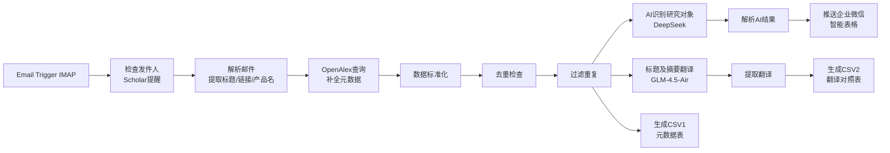

# 队名：[噫噫呜呜 呜喔嗷嗷地就shǎng来了](https://b23.tv/UVWUfws "皮兜会不能停")

> 基于 n8n 的论文自动化监控抓取工作流 — Noldus Product Monitor

<!-- 
只有熟练掌握黑体生物理论，才能有幸窥见李文亚教授之尊容

###%%%%%%%%%%%%%%%%%%%%%%%%%%%%%%%%%%%%%%%%%%%%%***++***++++++=======*%%%%%%%%%%%%%%%%%%%%%%%%%%%%%
#####%%%%%%%%%%%%%%%%%%%%%%%%%%%%%%%%%%%%%%%%%#******++***++++==========%%%%%%%%%%%%%%%%%%%%%%%%%%%
#####%%%%%%%%%%%%%%%##%%%%%%%%%%#%%%%%%%%%%%%%*****#******+++++==========+%%%%%%%%%%%%%%%%%%%%%%%%%
#######%%%%%%%%%####***#%#**%%%%%%%#%%%%%%%%%+****#####*****++++===========%%%%%%%%%%%%%%%%%%%%%%%%
######%%%%%%%%%%#*+#**++%*++*%%%%%%%%%%%%%%%**#####*#***+***++++=======--==*%%%%%%%%%%%%%%%%%%%%%%%
#######%%%%%%%%%%#*+#**++#++=*%%%%%%%%%%%%%#*############***+++=====------==%%%%%%%%%%%%%%%%%%%%%%%
#######%%%%%%%##%%#*+*+*+=##+=+%%%%%%%%%%%%*###########******+*++=====-----=#%%%%%%%%%%%%%%%%%%%%%%
#########%%%%%#**#%#*==+*+++=+=*%%%%%%%%#*%*########********+**++++===-----=#%%%%%%%#%%%%%%%%%%%%%%
########%%%%%%%%**###*===*++-++=%%%#**%#%%###*#%###*********+++*+**+==-----=============***********
#**############%%#++*#*==+**==+==**==*##%%%#*####%#**++++*++***++++===-----*%%%%%%#%%%%%**%%%%%#%%%
#***+****+*++*+**%#++***++++==+====--*##*++#*#%####*+**-=-==+#*+======-----*%%%%%#*#%%%%**%%%%++#%#
++*****+**********#****+#++++=+====--++#%#%##%%%###****-----*#*-----::-:--=#%%%%%%%%%%%%**%%##%#%##
++++++++++*+******%%#**+#*==*=+=-==--+#%%%%##%%%%##*#**==-==##+=----------=#%%%%%%#%#%%%**#%#%%#%##
*********##########%%#*+*###*======---####%##%%%%%##*++++*####+==--------==*%#%#%%#%*#%%**#%*#%*%#%
**********#########%%%%*+*****=====--*########%%%%##***+*#%%%#*+===========#%%%#%%%%%%%%**%%*%%#%*#
*****************####%%##+++*+====--=######*#%%######****###%%*+==-========%%%%#%%#%*%%%+*%%*%##%*%
+*******************##%%%#**++++====+######**#%###%%%#######=#*+--========##%#%##%#%*#%%+*%%*%###*#
+++++****************##%%%##+==*+===+######*-*###%%%%%%#####*+=--===-----#%%%%%%%%%%%%%%+*%%*%%%%#%
=++++++++++**+**********#%%%*+=+*++===-:::..:=*##%%%%%%##****+==--------:-+*#%%%%%#%#%%%=*%%#%%%%#%
=++++++++++++++====++====*%%#*++++++===:...:.==+*####*******++---------.........::-*%#%%=*%%#%%%%#%
===+++++++=----------=++-:==%#**++++====:..::.=-=+***####*++=--------:................-%=#%%#%%%%#%
=========-------------:::...%##***+++====-:::::.---=+++***++=-------:..............::::.-#%%#%%%%%%
=======---:--------:::......%####**+++=====::::::..:---=++==------:.................::::-#%%%#%%%%#
--====-----:-----:.:..:.....+%#####**+======-::::::..::--:::::-::.....................:::#%%###%%%%
--===-::----::---::..........%#####***+=====---:::::......::...........................::*%%%%%%%%%
--=++**:::::.:--::::.........:%######**++=====---::. ..::...............................:*%%#%%%%#%
++####*::::-+-:::::::..:......*%%#####**++=====---. ...::.   ..........................:-*%%#%#%%%%
**#####:::::---.::::.:.........#%%#####**++======---....:.  ...........................:=*%%#%#%#%%
 -->
---

## 📋 功能描述

**一句话**：一个运行在 n8n 上的自动化工作流，监听 Google Scholar 学术提醒邮件，自动抓取论文元数据、AI 识别研究对象并翻译成中文，最终推送企业微信智能表格。

### 解决了什么问题

Noldus 需要持续追踪引用自家产品（EthoVision、Track3D 等）的最新学术文献，用于市场宣传与技术参考。过去靠人工每天翻看 Scholar 提醒邮件再手动整理，存在三大痛点：

| 痛点 | 人工现状 | 本工作流 |
|------|---------|---------|
| 抓取效率低 | 每天手动点开提醒邮件、逐篇复制标题去查 DOI | 邮件一到即自动解析，OpenAlex 批量补全元数据 |
| 信息零散 | DOI、期刊、机构、领域散落各处，手动汇总易错 | 自动标准化为统一字段，按 DOI 智能去重 |
| 无法持续汇总 | 缺少"产品 × 研究对象"维度的整理，难支撑市场素材 | AI 识别研究对象（人/动物及品系）并翻译，落库企业微信智能表格 |

### 核心能力

1. **自动监听**：IMAP 监听收件箱，IF 节点只放行 Google Scholar 提醒邮件（`scholaralerts-noreply@google.com`）
2. **邮件解析**：Code 节点正则提取论文标题与链接，并从邮件主题自动识别对应 Noldus 产品名称
3. **元数据补全**：HTTP 请求调用 OpenAlex API（`api.openalex.org/works`）按标题检索，补齐 DOI、年份、期刊、作者、机构、研究领域、摘要；内置评分函数择优——有 DOI/期刊/机构信息加分，机构仓库（repository/server）降权
4. **智能去重**：按 DOI 分组只保留信息最丰富的记录，无 DOI 的记录按标题前缀匹配防重，跨批次不重复入库
5. **AI 研究对象识别**：DeepSeek 批量分析每篇论文，输出研究对象（人类分年龄类别；动物标注品系，如 `大鼠(SD)`、`小鼠(C57BL/6)`）、研究领域、第一作者单位中文翻译
6. **AI 翻译**：GLM-4.5-Air 将标题与摘要翻译成中文（AI Agent 节点，Anthropic 兼容接口接入）
7. **自动推送**：结果通过 webhook 实时写入企业微信智能表格（8 列：年份/发表单位/发表期刊/文章标题/研究对象/研究领域/原文链接/产品名称）
8. **CSV 报告**：生成两份带 BOM 的 CSV（元数据表 + 中英翻译对照表），以日期时间命名写入服务器 `~/.n8n-files/`

### 技术栈

n8n（Email Trigger / IF / Code / HTTP Request / LangChain Agent）+ OpenAlex API + DeepSeek（研究对象识别）+ GLM-4.5-Air（翻译）+ 企业微信智能表格 webhook

### 工作流结构



---

## 💬 核心 Prompt

工作流运行时的关键 Prompt（由 AI Agent 节点执行，两路 AI 分工：DeepSeek 做研究对象识别，GLM 做翻译）：

**1. 研究对象识别**（DeepSeek，返回 JSON 数组）
```text
分析以下论文的研究对象，返回JSON数组。每项包含：
- index: 序号(从0开始)
- researchSubject: 研究对象中文描述
- researchField: 研究领域中文描述（10个字以内短语词）
- researchInstitution: 第一作者所属单位中文翻译

研究对象分类规则：
- 人类：成人、儿童、幼儿、新生儿等
- 动物：大鼠(SD/Wistar等)、小鼠(C57BL/6等)、斑马鱼、果蝇、线虫等
- 如果是动物，尽量标注品系，如"大鼠(SD)"、"小鼠(C57BL/6)"

论文列表：
[0] 标题: ...  所属单位: ...  摘要: ...

动物的话只返回动物名称和品系（如有），人类的话只返回类别。不要加"动物"或"人类"
只返回JSON数组，不要其他内容。
```

**2. 标题及摘要翻译**（GLM-4.5-Air）
```text
将以下内容翻译成中文：

标题: {{ $json.title }}
摘要: {{ $json.abstract }}

返回格式：
标题翻译: [翻译]
摘要翻译: [翻译]
```

---

## 🎬 演示素材

- 工作流节点结构图见上方 Mermaid 流程图（共 18 个节点，实时运行中）。
- 运行效果截图（企业微信智能表格入库结果、CSV 报告样例）待补充。

---

*ruo · Noldus Product Monitor · 2026*
